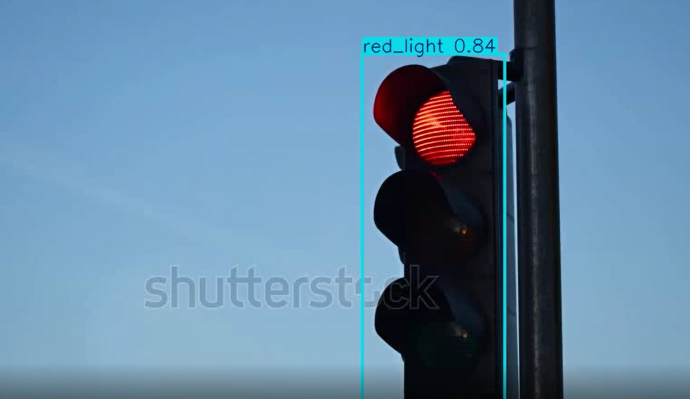

# Traffic-light detection for DMS system using YOLO V8




## Overview

This repository contains the implementation of a Traffic Light Detection Driver Monitoring System (DMS) using the YOLOv8 model. The system is designed to detect traffic lights in video feeds or images, leveraging custom-trained datasets to enhance detection accuracy and performance.

## Dataset

The custom training dataset used for this project includes a diverse set of images capturing traffic lights in different conditions and from various angles. The dataset is annotated with bounding boxes for the traffic lights, providing the necessary ground truth for training the YOLOv8 model. I used dataset from Roboflow.

## Installation

To run the Traffic Light Detection DMS system, follow these steps:

1. **Clone the Repository:**
   ```bash
   git clone https://github.com/Optimus-Q/Traffic-light.git
   cd traffic-light-detection-dms
   ```
   
2. **Install Dependencies:**
   ```bash
   pip install -r requirements.txt
   ```

3. **Download the Pretrained Model:**
   Download the pretrained YOLOv8 model weights and place them in the `models` directory.

## Usage

1. **Running the Detector:**
   To run the traffic light detection on a video feed:
   ```bash
   yolo task=detect mode=predict model=models/best.pt source=trafficlight.mp4
   ```

## Training

To train the YOLOv8 model on the custom dataset:

1. **Prepare the Dataset:**
   Ensure your dataset is structured correctly with images and corresponding annotations. Follow my blog article on this
   https://community.telemus.ai/post/36

   
## Training and validation metrics

### Loss plots

 1. Train/Box Loss:
     This plot shows the loss related to the bounding box prediction during training.
     The loss decreases steadily from around 1.5 to below 1.0, indicating that the model is learning to predict bounding boxes more accurately as training progresses.

2. Train/Cls Loss:
     This plot shows the classification loss during training.
     The loss decreases from around 2.0 to below 0.5, suggesting that the model is improving in classifying objects correctly.

3. Train/Dfl Loss:
     This plot shows the distribution focal loss during training.
     The loss decreases from around 1.3 to about 1.1, indicating improvement in the quality of the predicted bounding boxes' locations.

4. Val/Box Loss:
     This plot shows the validation loss related to bounding box prediction.
     Although more variable, the general trend shows a decrease from around 2.2 to 1.4, suggesting the model is also learning on the validation set.

5. Val/Cls Loss:
     This plot shows the classification loss during validation.
     The loss decreases from around 1.75 to about 0.5, similar to the training loss, indicating good generalization to the validation data.

6. Val/Dfl Loss:
     This plot shows the distribution focal loss during validation.
     The loss decreases from around 1.6 to about 1.1, reflecting improvements in the predicted bounding boxes' locations on the validation set.

### Metrics Plots

 1. Metrics/Precision (B):
     This plot shows the precision metric over epochs.
     The precision increases from around 0.6 to above 0.9, indicating that the model is correctly identifying positive instances more often.

 2. Metrics/Recall (B):
     This plot shows the recall metric over epochs.
     The recall increases from around 0.7 to above 0.9, suggesting that the model is correctly identifying more true positives as training progresses.

 3. Metrics/mAP50 (B):
     This plot shows the mean Average Precision at IoU threshold 0.5.
     The mAP50 increases from around 0.75 to above 0.95, reflecting a high level of accuracy in both detection and localization of objects.

 4. Metrics/mAP50-95 (B):
     This plot shows the mean Average Precision across IoU thresholds from 0.5 to 0.95.
     The mAP50-95 increases from around 0.3 to 0.6, showing improvement in overall model performance considering stricter IoU thresholds.

